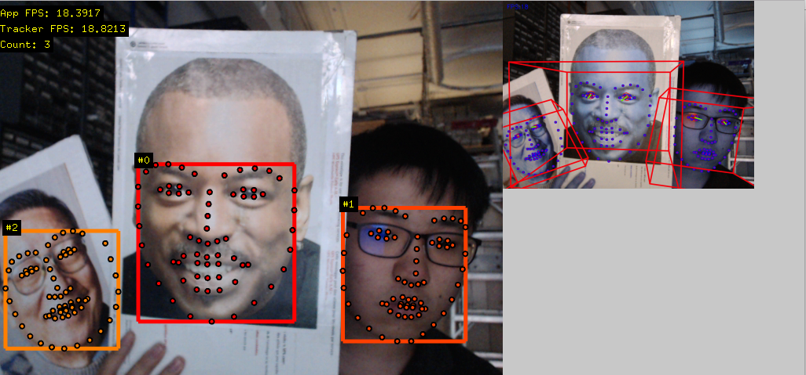

# ofxOpenFace
An [openFrameworks](https://openframeworks.cc) addon wrapping [OpenFace](https://github.com/TadasBaltrusaitis/OpenFace), the C++ facial landmark detection toolkit. Compared to master, this branch uses a different approach. It attempts to be thinner, faster, and identical to the [TadasBaltrusaitis/OpenFace examples](https://github.com/TadasBaltrusaitis/OpenFace/tree/master/exe).

The interface is also different from master. See `example` and `example_threaded` for details.

## Installation

Use [homebrew](https://brew.sh) to install tbb, openblas and opencv:

```
/usr/bin/ruby -e "$(curl -fsSL https://raw.githubusercontent.com/Homebrew/install/master/install)"; brew install tbb; brew install opencv; brew install openblas;
```
Paste that at a Terminal prompt.

This addon uses [ofxCv](https://github.com/kylemcdonald/ofxCv).

The [model](https://github.com/TadasBaltrusaitis/OpenFace/wiki/Model-download) files needs to be manually downloaded and placed in `bin/data` folder (See [TadasBaltrusaitis/OpenFace/wiki/Model-download](https://github.com/TadasBaltrusaitis/OpenFace/wiki/Model-download)). Alternatively place them anywhere and set `model_location` of the `ofxOpenFace::SingleFace`/`ofxOpenFace::MultipleFace`. object.


